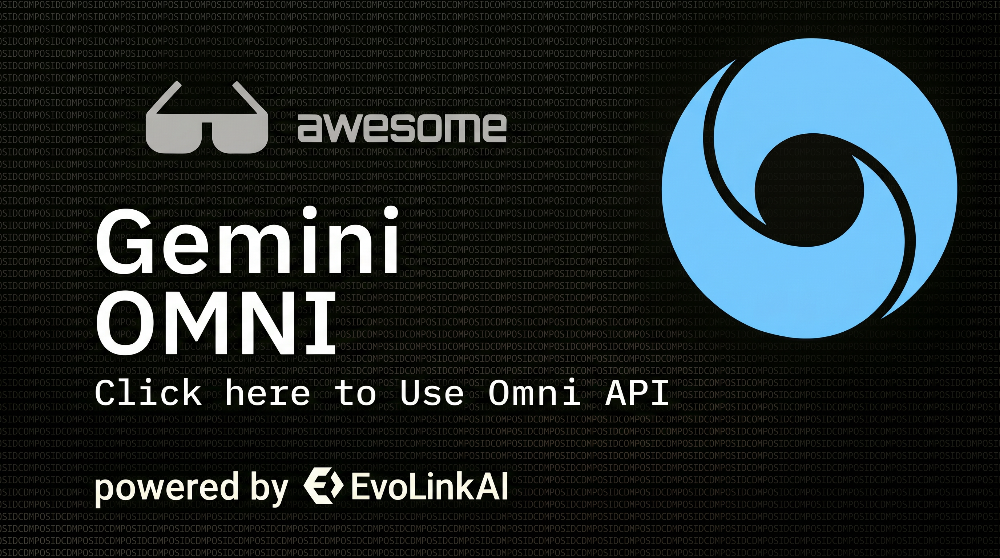
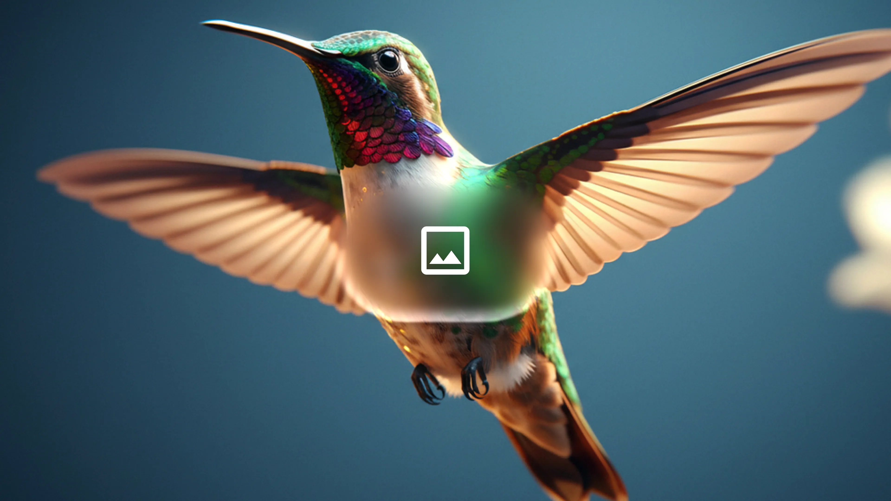
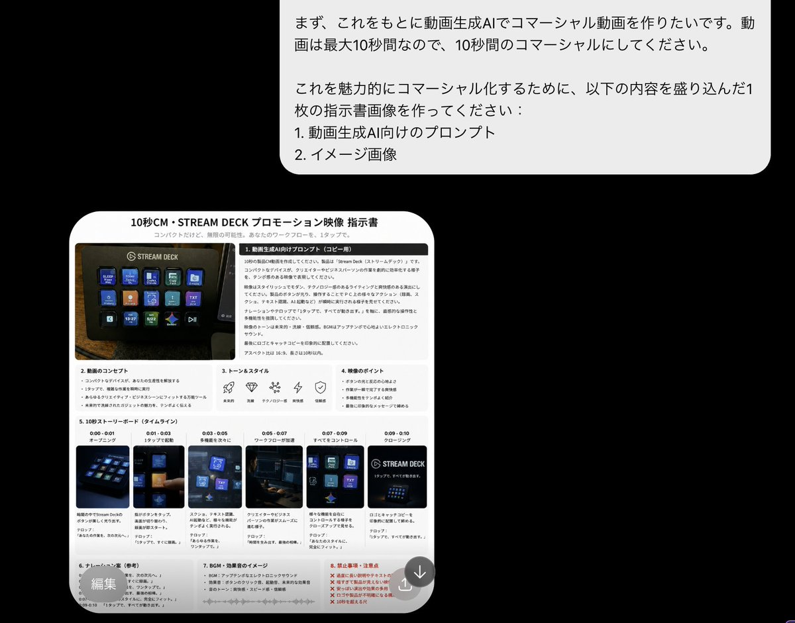
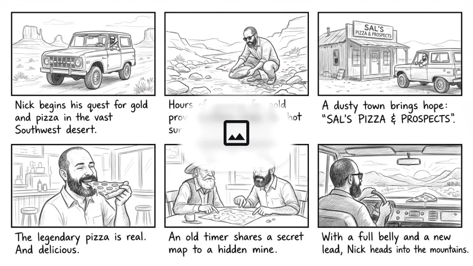
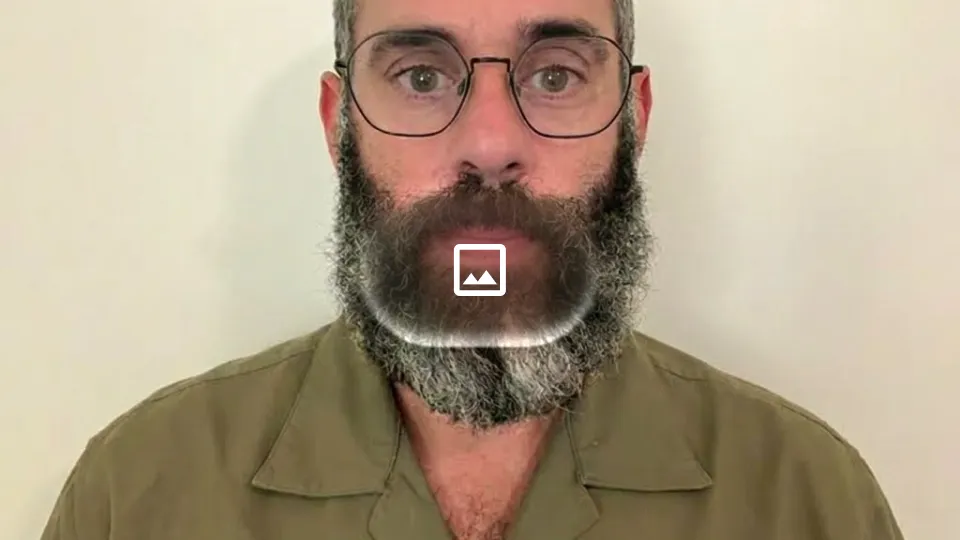

<div align="center">

<a href="https://evolink.ai/gemini-omni?utm_source=github&utm_medium=banner&utm_campaign=awesome-gemini-omni"></a>

[](LICENSE)
[](https://evolink.ai/gemini-omni?utm_source=github&utm_medium=readme&utm_campaign=awesome-gemini-omni)
[](https://evolink.ai?utm_source=github&utm_medium=readme&utm_campaign=awesome-gemini-omni)

[](README.md)
[](README_es.md)
[](README_pt.md)
[](README_ja.md)
[](README_ko.md)
[](README_de.md)
[](README_fr.md)
[](README_tr.md)
[](README_zh-TW.md)
[](README_zh-CN.md)
[](README_ru.md)

</div>

## 🍌 Einführung
Willkommen im Gemini Omni API und Prompts Repository! 🤗
**Wir sammeln hochwertige Prompts und Videobeispiele für Google Gemini Omni für eine Vielzahl kreativer Aufgaben, darunter Transformation, Bewegung, Kamerasteuerung, Textsequenzen und Multi-Input-Workflows.**
Die meisten Fälle in diesem Repository stammen aus offiziellen DeepMind-Demos, Prompt-Anleitungen und Community-Experimenten.
Ausprobieren auf Evolink: [Gemini Omni](https://evolink.ai/gemini-omni?utm_source=github&utm_medium=readme&utm_campaign=awesome-gemini-omni)
Wenn du das nützlich findest, hinterlasse gerne einen Stern. ⭐
> [!NOTE]
> Dieses Repository konzentriert sich auf wiederverwendbare Prompt-Muster und Referenzfälle für die Gemini Omni Videogenerierung auf Evolink.

## 📰 Neuigkeiten
- **25. Mai 2026:** 16 neue Community-Fälle + neue Community-Galerie-Sektion hinzugefügt
- **23. Mai 2026:** 10 Community-Showcase-Fälle aus Trend-Tweets hinzugefügt
- **22. Mai 2026:** Erstes Repository-Update mit 25 kuratierten Gemini Omni Prompts

## 📑 Menü
- [🎯 Prompt-Zutaten](#-prompt-zutaten)
- [✂️ Bearbeitung](#️-bearbeitung)
  - [🔄 Element-Ersetzung](#-element-ersetzung)
    - [Fall 1: Schmetterling zu Biene](#fall-1-schmetterling-zu-biene)
    - [Fall 2: Biene zu Glühwürmchen](#fall-2-biene-zu-glühwürmchen)
    - [Fall 3-5: Raumschiffe & Astronauten-Serie](#fall-3-5-raumschiffe--astronauten-serie)
    - [Fall 6: Zug 1896 Transformation (von @emollick)](#fall-6-zug-1896-transformation-von-emollick)
    - [Fall 7: Person aus Video entfernen (von @arrakis_ai)](#fall-7-person-aus-video-entfernen-von-arrakis_ai)
    - [Fall 8: Unsichtbare Geige](#fall-8-unsichtbare-geige)
    - [Fall 9: Standortwechsel durch Weltwissen (von @venturetwins)](#fall-9-standortwechsel-durch-weltwissen-von-venturetwins)
    - [Fall 10: Animation zu Realfilm (von @arrakis_ai)](#fall-10-animation-zu-realfilm-von-arrakis_ai)
  - [🎬 Basisszene](#-basisszene)
    - [Fall 1: Geiger Basisaufnahme](#fall-1-geiger-basisaufnahme)
  - [📷 Kameraführung](#-kameraführung)
    - [Fall 1: Über-die-Schulter-Perspektive](#fall-1-über-die-schulter-perspektive)
    - [Fall 2: Kameraneigung Schuhe zur Halbtotale](#fall-2-kameraneigung-schuhe-zur-halbtotale)
    - [Fall 3: Reise-Selfie-Hyperlapse (von @ZaraIrahh)](#fall-3-reise-selfie-hyperlapse-von-zarairahh)
    - [Fall 4: Mode-Drohnenaufnahme (von @ariaxawan)](#fall-4-mode-drohnenaufnahme-von-ariaxawan)
    - [Fall 5: Draufsicht zu 360-Grad-Rotation (von @npaka123)](#fall-5-draufsicht-zu-360-grad-rotation-von-npaka123)
    - [Fall 6: Omnizoom — Eintauchen in ein Foto (von @alexanderchen)](#fall-6-omnizoom--eintauchen-in-ein-foto-von-alexanderchen)
  - [🎬 Aktion & Synchronisation](#-aktion--synchronisation)
    - [Fall 1: Tierspielzeug-Geräusch](#fall-1-tierspielzeug-geräusch)
    - [Fall 2: Wohnungslichter-Synchronisation](#fall-2-wohnungslichter-synchronisation)
    - [Fall 3: Murmel-Kettenreaktion](#fall-3-murmel-kettenreaktion)
    - [Fall 4: Gebäudelichter](#fall-4-gebäudelichter)
    - [Fall 5: Boxkampf Realistisch (von @RuzainaMeer)](#fall-5-boxkampf-realistisch-von-ruzainameer)
- [🎨 Erweitert Multi-Modal](#-erweitert-multi-modal)
  - [🪞 Künstlerischer Stil](#-künstlerischer-stil)
    - [Fall 1-3: Spiegel-Serie](#fall-1-3-spiegel-serie)
    - [Fall 4: Animations-Werbung One Shot (von @DenneyDara)](#fall-4-animations-werbung-one-shot-von-denneydara)
    - [Fall 5: Strichzeichnung-Isolation (von @alexanderchen)](#fall-5-strichzeichnung-isolation-von-alexanderchen)
  - [✨ Visuelle Effekte](#-visuelle-effekte)
    - [Fall 1: Hand-Loch Super-Zoom](#fall-1-hand-loch-super-zoom)
    - [Fall 2: Skateboard-Bewegungseffekte](#fall-2-skateboard-bewegungseffekte)
    - [Fall 3: AR HUD Overlay (von @jerrod_lew)](#fall-3-ar-hud-overlay-von-jerrod_lew)
  - [🔗 Cross-Modal](#-cross-modal)
    - [Fall 1: Transport in neue Umgebung](#fall-1-transport-in-neue-umgebung)
    - [Fall 2: Vogelformation mit Audio](#fall-2-vogelformation-mit-audio)
    - [Fall 3: Folie zu Bewegung (von @yoshifujidesign)](#fall-3-folie-zu-bewegung-von-yoshifujidesign)
    - [Fall 4: Isometrischer Koch-Charakter mit Referenzbild (von @kumiko_shiraki)](#fall-4-isometrischer-koch-charakter-mit-referenzbild-von-kumiko_shiraki)
    - [Fall 5: ChatGPT-Anweisungsbild als Eingabe (von @Majin_AppSheet)](#fall-5-chatgpt-anweisungsbild-als-eingabe-von-majin_appsheet)
    - [Fall 6: ChatGPT-Illustration zu Omni-Animation (von @mmmiyama_D)](#fall-6-chatgpt-illustration-zu-omni-animation-von-mmmiyama_d)
  - [📋 Storyboard](#-storyboard)
    - [Fall 1: Luxus-Kosmetik-Werbespot (von @aiwithaly)](#fall-1-luxus-kosmetik-werbespot-von-aiwithaly)
    - [Fall 2: Zeig mich in dieser Geschichte](#fall-2-zeig-mich-in-dieser-geschichte)
    - [Fall 3: 3x3 Splitscreen (von @alexanderchen)](#fall-3-3x3-splitscreen-von-alexanderchen)
    - [Fall 4: Action-Replay aus verschiedenen Winkeln (von @jerrod_lew)](#fall-4-action-replay-aus-verschiedenen-winkeln-von-jerrod_lew)
    - [Fall 5: Splitscreen-Video (von @jerrod_lew)](#fall-5-splitscreen-video-von-jerrod_lew)
  - [🔤 Textdarstellung](#-textdarstellung)
    - [Fall 1: Alphabet-Gegenstände-Sequenz](#fall-1-alphabet-gegenstände-sequenz)
    - [Fall 2: Wort-für-Wort Text-Synchronisation](#fall-2-wort-für-wort-text-synchronisation)
    - [Fall 3: Textdarstellung KI-Nachrichten (von @chrisfirst)](#fall-3-textdarstellung-ki-nachrichten-von-chrisfirst)
    - [Fall 4: Schriftarten-Modenschau (von @HBCoop_)](#fall-4-schriftarten-modenschau-von-hbcoop_)
- [⚖️ Vergleich](#️-vergleich)
  - [Fall 1: Seedance 2.0 vs Gemini Omni Flash (von @JSFILMZ0412)](#fall-1-seedance-20-vs-gemini-omni-flash-von-jsfilmz0412)
  - [Fall 2: Gemini Omni vs Seedance 2.0 Actionszenen (von @CuriousRefuge)](#fall-2-gemini-omni-vs-seedance-20-actionszenen-von-curiousrefuge)
- [🧪 Bewertung](#-bewertung)
  - [Fall 1: Gemini Omni Qualitätsbewertung (von @kenichiota0711)](#fall-1-gemini-omni-qualitätsbewertung-von-kenichiota0711)
- [🌐 Community-Galerie](#-community-galerie)
- [🙏 Danksagung](#-danksagung)

## 🎯 Prompt-Zutaten
Gemini Omni verfügt über ein starkes **Weltverständnis** — es greift auf reales Wissen über Geschichte, Wissenschaft und Kultur zurück. Du musst nicht jedes Detail übermäßig erklären. Drücke stattdessen deine kreative Absicht in natürlicher Sprache aus und lass Omnis Reasoning den Rest ergänzen.
Wenn du ein neues Video von Grund auf erstellst, kombiniere diese Dimensionen, um die Ausgabe zu steuern:
| Dimension | Was angegeben werden sollte | Beispiel |
| :--- | :--- | :--- |
| **Bildausschnitt & Bewegung** | Weitwinkel, Halbtotale oder Nahaufnahme. Kameratrajektorie: sanftes Gleiten, plötzlicher Schwenk, statische Fixierung, Dolly-Zoom usw. | `A close-up tracking shot smoothly pushing in` |
| **Stil** | Gesamte visuelle Art Direction | `Vintage monochrome hologram`, `3D voxel art`, `colored crayon aesthetic` |
| **Beleuchtung** | Szenen-Stimmung und Lichtaufbau | `Warm champagne lighting`, `dim overhead gym lights` |
| **Ort** | Umgebung und Hintergrund | `Small underground gym`, `futuristic neon cityscape` |
| **Aktion** | Verhalten und Bewegung des Subjekts | `The person touches the mirror`, `a marble rolling fast on a chain reaction track` |
> [!TIP]
> **Iteratives Bearbeiten:** Omni unterstützt Multi-Turn-Konversationsbearbeitung. Es bewahrt, was funktioniert, und ändert nur das, was du verlangst — du musst nicht jedes Mal die gesamte Szene neu beschreiben. Sage einfach, was als Nächstes geändert werden soll.

> [!TIP]
> **[Unveränderte Bereiche bewahren](https://x.com/tanabe_fragm/status/2058103447006896406) (von [@tanabe_fragm](https://x.com/tanabe_fragm)):** Beim Bearbeiten von Videos füge Sätze wie "Ändere nichts anderes" oder "Behalte alles andere unverändert" zu deinem Prompt hinzu. Dies reduziert deutlich ungewollte Änderungen an Teilen, die du nicht modifizieren wolltest.
>
> https://github.com/user-attachments/assets/285ee7d8-7dfe-4304-a9a4-648026073b80

## ✂️ Bearbeitung

### 🔄 Element-Ersetzung

#### Fall 1: Schmetterling zu Biene `🎬 Video→Video`

<table>
<tr>
<td width="300">

**Eingabe:**

https://github.com/user-attachments/assets/8feb4d7b-825d-4a4a-bd9d-900754cf5d38

</td>
<td width="300">

**Ausgabe:**

https://github.com/user-attachments/assets/60f31f6d-895e-4048-b477-9a46a5d20b90

</td>
</tr>
</table>

**Prompt:**

```
Change the butterfly to a bee.
```

---

#### Fall 2: Biene zu Glühwürmchen `🎬 Video→Video`

<table>
<tr>
<td width="300">

**Eingabe:**

https://github.com/user-attachments/assets/60f31f6d-895e-4048-b477-9a46a5d20b90

</td>
<td width="300">

**Ausgabe:**

https://github.com/user-attachments/assets/76fc8e97-c7d1-40bc-9e79-bd6705aa8267

</td>
</tr>
</table>

**Prompt:**

```
Change the bee into a small swarm of fireflies.
```

---

#### Fall 3-5: Raumschiffe & Astronauten-Serie `🎬 Video→Video`

<table>
<tr>
<td colspan="3">

**Eingabe:**

https://github.com/user-attachments/assets/26ea7e43-9787-4096-82f9-e10543229bec

</td>
</tr>
<tr>
<td width="300">

https://github.com/user-attachments/assets/dd9ae5b1-0205-45ac-a651-258af1c4f12c

#### Fall 3: Raumschiffe zu weißem Origami

</td>
<td width="300">

https://github.com/user-attachments/assets/78ef5301-b759-4dda-9995-3ee0d259a7b1

#### Fall 4: Astronaut zu Seeanemone

</td>
<td width="300">

https://github.com/user-attachments/assets/0cbadb19-8a5b-4a2c-9093-e3a84f3dd988

#### Fall 5: Kleine Schiffe zu Rochen

</td>
</tr>
</table>

**Prompts:**

```
Case 3: Change the ships to be made from white origami paper.
```

```
Case 4: Change the astronaut to a sea anemone.
```

```
Case 5: Change the small ships to stingrays.
```

---

#### Fall 6: [Zug 1896 Transformation](https://x.com/emollick/status/2057874739817808223) (von [@emollick](https://x.com/emollick)) `🎬 Video→Video`

https://github.com/user-attachments/assets/275cc90e-adaa-48ff-9ff8-1e96ea29d44f

**Prompt:**

```
I took the famous "train" movie from 1896 & made it a bullet train, LEGO, added a time traveler, a centipede, muppets...
```

---

#### Fall 7: [Person aus Video entfernen](https://x.com/arrakis_ai/status/2057939231755178439) (von [@arrakis_ai](https://x.com/arrakis_ai)) `🎬 Video→Video`

https://github.com/user-attachments/assets/72379fb2-ac30-4d1e-a6b4-143052f8f061

**Prompt:**

```
Remove the person from this video perfectly.
```

---

#### Fall 8: Unsichtbare Geige `🎬 Video→Video`

<table>
<tr>
<td width="300">

**Eingabe:**

https://github.com/user-attachments/assets/88176743-d17e-48fe-89f3-528fe60df7fd

</td>
<td width="300">

**Ausgabe:**

https://github.com/user-attachments/assets/ac6457aa-158c-4a0b-852f-ce1f3367bc3f

</td>
</tr>
</table>

**Prompt:**

```
Make the violin invisible
```

---

#### Fall 9: [Standortwechsel durch Weltwissen](https://x.com/venturetwins/status/2058235415883313361) (von [@venturetwins](https://x.com/venturetwins)) `🎬 Video→Video`

https://github.com/user-attachments/assets/daa90750-fc7b-49ea-b85d-364411159663

**Prompt:**

```
Re-shoot this video in [location] based on the screenshot from Google Maps.
```

---

#### Fall 10: [Animation zu Realfilm](https://x.com/arrakis_ai/status/2058488373057302797) (von [@arrakis_ai](https://x.com/arrakis_ai)) `🎬 Video→Video`

https://github.com/user-attachments/assets/3c6be2a9-3e67-4deb-8ccd-fb493b715f65

**Prompt:**

```
Turn this animation into live action.
```

### 🎬 Basisszene

#### Fall 1: Geiger Basisaufnahme `🔤 Text→Video`

https://github.com/user-attachments/assets/93de5898-88ee-4bfc-a36f-19d8aa99dfc1

**Prompt:**

```
A video of a violinist playing a song.
```

### 📷 Kameraführung

#### Fall 1: Über-die-Schulter-Perspektive `🎬 Video→Video`

<table>
<tr>
<td width="300">

**Eingabe:**

https://github.com/user-attachments/assets/ac6457aa-158c-4a0b-852f-ce1f3367bc3f

</td>
<td width="300">

**Ausgabe:**

https://github.com/user-attachments/assets/71aa1c8d-0287-4591-b239-68322919293d

</td>
</tr>
</table>

**Prompt:**

```
Change the camera angle to be over the violinist's shoulder.
```

---

#### Fall 2: Kameraneigung Schuhe zur Halbtotale `🎬 Video→Video`

<table>
<tr>
<td width="300">

**Eingabe:**

https://github.com/user-attachments/assets/19dbc1ae-1e9e-4b7b-9069-e979fffe3651

</td>
<td width="300">

**Ausgabe:**

https://github.com/user-attachments/assets/c0ccbda0-4fd0-42be-8620-db7a67a5347d

</td>
</tr>
</table>

**Prompt:**

```
Change the camera angle, a close-up on his shoes, quickly tilting up to medium shot, then widening.
```

---

#### Fall 3: [Reise-Selfie-Hyperlapse](https://x.com/ZaraIrahh/status/2057775215749349520) (von [@ZaraIrahh](https://x.com/ZaraIrahh)) `🔤 Text→Video`

https://github.com/user-attachments/assets/31fa5a56-6113-4376-873b-5e40d26803f1

**Prompt:**

```
Create a 10-second cinematic hyper-lapse selfie travel video of the uploaded female character across 20 world-famous destinations in 2026. Hard cuts every 0.5 seconds synced to the beat. Handheld selfie-stick camera, wide-angle lens, close selfie framing, energetic travel-vlogger style, vibrant cinematic colors, realistic lighting, dynamic motion blur, natural crowds, and clear landmarks in every shot.
```

---

#### Fall 4: [Mode-Drohnenaufnahme](https://x.com/ariaxawan/status/2057794715744084042) (von [@ariaxawan](https://x.com/ariaxawan)) `🔤 Text→Video`

https://github.com/user-attachments/assets/b199a5ab-e008-4a72-aa03-094bc6d573e6

**Prompt:**

```
A 10 second ultra cinematic hyper realistic FPV fashion drone shot filmed in a single continuous take inside a futuristic luxury tunnel. Single continuous take, aggressive FPV motion, ultra smooth cinematic flight path, luxury high-fashion editorial atmosphere.
```

---

#### Fall 5: [Draufsicht zu 360-Grad-Rotation](https://x.com/npaka123/status/2058033145845575735) (von [@npaka123](https://x.com/npaka123)) `🖼️ Image→Video`

https://github.com/user-attachments/assets/1ad202cb-a485-4b7a-9c8c-d4fea4a3b6d5

**Prompt:**

```
この教室の中央から黒板を見ているファーストパーソンなゲーム視点。360度カメラを回転。教室の黒板右側の窓の外は廊下、黒板左側の窓の外は校庭。
```

---

#### Fall 6: [Omnizoom — Eintauchen in ein Foto](https://x.com/alexanderchen/status/2058330610574221672) (von [@alexanderchen](https://x.com/alexanderchen)) `🖼️ Image→Video`

https://github.com/user-attachments/assets/9fd3ad2a-6e4a-4ac0-ab29-48f1c303b95f

**Prompt:**

```
Omnizoom — diving into a photo.
```

### 🎬 Aktion & Synchronisation

#### Fall 1: Tierspielzeug-Geräusch `🎬 Video→Video`

https://github.com/user-attachments/assets/fbf377d7-1b39-43af-92e6-665792d05de0

**Prompt:**

```
When the finger in <video> touches the animal toy play the sound the animal makes
```

---

#### Fall 2: Wohnungslichter-Synchronisation `🎬+🎵 Video+Audio→Video`

<table>
<tr>
<td width="300">

**Eingabe:**

https://github.com/user-attachments/assets/6fa879c3-5ee8-4ff1-bbe9-6648d750277d

</td>
<td width="300">

**Ausgabe:**

https://github.com/user-attachments/assets/3f010e2a-a471-4b0d-8782-c4c5547cd2a5

</td>
</tr>
</table>

**Prompt:**

```
The lights of the apartments start turning on in sync with the music.
```

---

#### Fall 3: Murmel-Kettenreaktion `🔤 Text→Video`

https://github.com/user-attachments/assets/1ece8df7-f29a-4ebd-ad68-9c910f811590

**Prompt:**

```
A marble rolling fast on a chain reaction style track, continuous smooth shot
```

---

#### Fall 4: Gebäudelichter `🎬+🎵 Video+Audio→Video`

<table>
<tr>
<td width="300">

**Eingabe:**

https://github.com/user-attachments/assets/efbc0d8d-b64a-4ef9-afe6-fed4a8b66102

</td>
<td width="300">

**Ausgabe:**

https://github.com/user-attachments/assets/51727436-1fc2-426b-afaa-86bb63cfba0f

</td>
</tr>
</table>

**Prompt:**

```
The lights of the buildings start turning on in sync with the music.
```

---

#### Fall 5: [Boxkampf Realistisch](https://x.com/RuzainaMeer/status/2057785474446741728) (von [@RuzainaMeer](https://x.com/RuzainaMeer)) `🔤 Text→Video`

https://github.com/user-attachments/assets/6796bf78-8bad-441c-889d-30621ee62cd7

**Prompt:**

```
Ultra-realistic 10-second boxing fight between two women inside a small underground gym. Both fighters look naturally athletic with realistic skin texture, sweat, bruises, and detailed facial expressions. The fight feels raw and authentic, like real professional sparring footage. The camera moves handheld around the ring at close range, capturing fast punches, defensive movement, realistic footwork, and heavy breathing.
```

## 🎨 Erweitert Multi-Modal

### 🪞 Künstlerischer Stil

#### Fall 1-3: Spiegel-Serie `🎬 Video→Video`

<table>
<tr>
<td width="300">

https://github.com/user-attachments/assets/747cdc6b-f5fa-4482-b745-2839551e9ba2

#### Fall 1: Spiegel Flüssigmetall-Welle

</td>
<td width="300">

https://github.com/user-attachments/assets/36ea02a2-3716-44aa-9bc2-a5cc1480d0bf

#### Fall 2: Spiegel Strichzeichnung

</td>
<td width="300">

https://github.com/user-attachments/assets/dbca6772-dd7a-4418-a0e6-a39796a91c97

#### Fall 3: Spiegel Puppe

</td>
</tr>
</table>

**Prompts:**

```
Case 1: When the person touches the mirror, make the mirror ripple beautifully like liquid, and the person's arm turns into reflective mirror material
```

```
Case 2: When the person touches the mirror, the person transforms into a detailed monochrome line art drawing
```

```
Case 3: When the person touches the mirror, the person suddenly transforms into a cute felted stuffed puppet version with large googley eyes and glasses
```

---

#### Fall 4: [Animations-Werbung One Shot](https://x.com/DenneyDara/status/2057844409639551380) (von [@DenneyDara](https://x.com/DenneyDara)) `🔤 Text→Video`

https://github.com/user-attachments/assets/edacf1c5-94db-4687-8eaa-f87ebf5fabee

**Prompt:**

```
Make a Pixar-style video of an aloe leaf that is walking through the forest that talks about how good nature makes it feel. Have it say, "Organic and healthy ingredients make me feel so good."
```

---

#### Fall 5: [Strichzeichnung-Isolation](https://x.com/alexanderchen/status/2057925025915666673) (von [@alexanderchen](https://x.com/alexanderchen)) `🎬 Video→Video`

https://github.com/user-attachments/assets/787813c0-2e20-4999-8383-fd76a9b21f91

**Prompt:**

```
Extract the key object in this video. Render a video showing that object as a black diagram-style line art drawing on solid 100% white background, nothing else in background. Keep the motion and sound exactly as is.
```

### ✨ Visuelle Effekte

#### Fall 1: Hand-Loch Super-Zoom `🎬 Video→Video`

https://github.com/user-attachments/assets/06683ef4-16e0-47b0-93ec-c6222560ee13

**Prompt:**

```
Make it look like the weird shape of my hand hole super zooms and magnifies the ground it's looking at in sharper quality.
```

---

#### Fall 2: Skateboard-Bewegungseffekte `🎬 Video→Video`

https://github.com/user-attachments/assets/44c120a2-38a7-43d7-89fa-a23d0842078c

**Prompt:**

```
Edit this keeping everything the same. Add animated motion effects coming out of the skateboard.
```

---

#### Fall 3: [AR HUD Overlay](https://x.com/jerrod_lew/status/2058337271947079977) (von [@jerrod_lew](https://x.com/jerrod_lew)) `🎬 Video→Video`

https://github.com/user-attachments/assets/04b11cd7-d345-4172-b6e5-38301e73bb77

**Prompt:**

```
Create a virtual HUD and UI overlay for this recorded phone video, like an AR glasses experience with secondary screens.
```

### 🔗 Cross-Modal

#### Fall 1: Transport in neue Umgebung `🎬+🖼️ Video+Image→Video`

<table>
<tr>
<td width="300">

**Eingabe:**

https://github.com/user-attachments/assets/93de5898-88ee-4bfc-a36f-19d8aa99dfc1

</td>
<td width="300">

**Ausgabe:**

https://github.com/user-attachments/assets/88176743-d17e-48fe-89f3-528fe60df7fd

</td>
</tr>
</table>

**Prompt:**

```
Transport the violinist to the image environment
```

---

#### Fall 2: Vogelformation mit Audio `🎬+🖼️+🎵 Multi-Modal`

<table>
<tr>
<td width="300">

**Eingabe-Video:**

https://github.com/user-attachments/assets/66946870-b366-4981-90b3-c9a35aca69b1

**Eingabe-Bild:**



**Eingabe-Audio:**

https://github.com/user-attachments/assets/6d79cd06-7805-493c-9f27-6985a3da1866

</td>
<td width="300">

**Ausgabe:**

https://github.com/user-attachments/assets/a94efea9-14ac-47c2-ab5f-9492400fdc3a

</td>
</tr>
</table>

**Prompt:**

```
The birds from <video> loosely form the imperfect shape of a bird based on <image>. They move to the music from <audio> and dissipate as they fly
```

---

#### Fall 3: [Folie zu Bewegung](https://x.com/yoshifujidesign/status/2058032203175731293) (von [@yoshifujidesign](https://x.com/yoshifujidesign)) `🖼️ Image→Video`

https://github.com/user-attachments/assets/f07a861b-cd0d-4894-8ef1-b74520c7cbd7

**Prompt:**

```
GPT image2でスライド作成 → Gemini Omniでモーション。画面遷移もさせられるし、イラストの動かし方も自然。
```

---

#### Fall 4: [Isometrischer Koch-Charakter mit Referenzbild](https://x.com/kumiko_shiraki/status/2058337185099546885) (von [@kumiko_shiraki](https://x.com/kumiko_shiraki)) `🖼️ Image→Video`

https://github.com/user-attachments/assets/d5e9b97e-cefa-4cd8-bf70-4e633020f092

**Prompt:**

```
Narrow down reference images and add negative prompts to get closer to your ideal output.
```

---

#### Fall 5: [ChatGPT-Anweisungsbild als Eingabe](https://x.com/Majin_AppSheet/status/2058191091070058846) (von [@Majin_AppSheet](https://x.com/Majin_AppSheet)) `🖼️ Image→Video`

<table>
<tr>
<td width="300">

**Eingabe (Anweisungsbilder von ChatGPT):**



</td>
<td width="300">

**Ausgabe:**

https://github.com/user-attachments/assets/578d6968-c6dd-417a-b6fe-100468851f3d

</td>
</tr>
</table>

---

#### Fall 6: [ChatGPT-Illustration zu Omni-Animation](https://x.com/mmmiyama_D/status/2058654389326516656) (von [@mmmiyama_D](https://x.com/mmmiyama_D)) `🖼️ Image→Video`

<table>
<tr>
<td width="280">

https://github.com/user-attachments/assets/5759f07e-6b2a-4b7d-bb36-52e960a6559e

</td>
<td width="280">

https://github.com/user-attachments/assets/b4fea213-9a0e-46c9-8a6e-9e98b566ffab

</td>
<td width="280">

https://github.com/user-attachments/assets/289e5378-60ad-472b-ba51-da710da81270

</td>
</tr>
</table>

### 📋 Storyboard

#### Fall 1: [Luxus-Kosmetik-Werbespot](https://x.com/aiwithaly/status/2057806821138858314) (von [@aiwithaly](https://x.com/aiwithaly)) `🔤 Text→Video`

https://github.com/user-attachments/assets/6d003859-eb77-4466-9f70-5a76a2269667

**Prompt:**

```
Create a cinematic 10-second ultra-realistic luxury cosmetic commercial in a high-end skincare advertisement style. Use warm champagne lighting, glossy beauty-film aesthetic, shallow depth of field, macro beauty cinematography, smooth cinematic camera movement. 10 scenes from macro serum droplets to final payoff shot.
```

---

#### Fall 2: Zeig mich in dieser Geschichte `🖼️ Image→Video`

<table>
<tr>
<td width="300">

**Eingabe:**




</td>
<td width="300">

**Ausgabe:**

https://github.com/user-attachments/assets/8429423d-9b72-4cb6-9e8c-985818f160a7

</td>
</tr>
</table>

**Prompt:**

```
Show me in this story. Follow the story exactly in order starting top left. Entire story in 10 seconds. Cinematic
```

---

#### Fall 3: [3x3 Splitscreen](https://x.com/alexanderchen/status/2057861567396368841) (von [@alexanderchen](https://x.com/alexanderchen)) `🎬 Video→Video`

https://github.com/user-attachments/assets/587fc95e-526f-4d8d-94c8-feefe34edba9

**Prompt:**

```
Generate a 3x3 split screen video based on different details you see here. Make each cell different, varying the perspective, composition, zoom, angle, camera movement (some static, some moving). Make some of the cells extreme close-ups with detailed textures. Keep it photorealistic, handheld, raw. Only natural sounds.
```

---

#### Fall 4: [Action-Replay aus verschiedenen Winkeln](https://x.com/jerrod_lew/status/2057838324140953773) (von [@jerrod_lew](https://x.com/jerrod_lew)) `🎬 Video→Video`

https://github.com/user-attachments/assets/a1179492-74bd-488c-b594-6bc023269c10

**Prompt:**

```
Gemini Omni can create action replays from different angles. I referenced a video clip with agent instructions to generate replays.
```

---

#### Fall 5: [Splitscreen-Video](https://x.com/jerrod_lew/status/2057944349846249975) (von [@jerrod_lew](https://x.com/jerrod_lew)) `🎬 Video→Video`

https://github.com/user-attachments/assets/8755d95d-a9b2-4f7c-a56d-bfbbcc47f80e

**Prompt:**

```
Use a reference video and ask the agent for a split screen video.
```

### 🔤 Textdarstellung

#### Fall 1: Alphabet-Gegenstände-Sequenz `🔤 Text→Video`

https://github.com/user-attachments/assets/f7693ec2-ac70-4ac8-813f-8fcb46d90d3d

**Prompt:**

```
The video shows items of the alphabet. An unusual item starting with each letter is shown sitting on a table. All 26 letters must be represented by 26 items with matching lower thirds displaying the letter. Only one item and lower third at a time. Rapid fire, roughly 9 frames per item at 24FPS. Last frame is a slip of paper "THE END".
```

---

#### Fall 2: Wort-für-Wort Text-Synchronisation `🔤 Text→Video`

https://github.com/user-attachments/assets/03620abc-bcb2-4011-a52b-ce13409853c4

**Prompt:**

```
word by word, one word on the screen at a time: did, you, know, that, this, model, can, do, pretty, good, text!? each word appears with a different animated style, perfect pacing to a rhythm, sizzle reel.
```

---

#### Fall 3: [Textdarstellung KI-Nachrichten](https://x.com/chrisfirst/status/2057863432469361098) (von [@chrisfirst](https://x.com/chrisfirst)) `🔤 Text→Video`

https://github.com/user-attachments/assets/e7d23502-1ca0-4f47-be76-47ff05390508

**Prompt:**

```
Static shot we see them turn the page 3 times. Every flip we see content on both left and right side of book pages. Each contains a big news story around AI for the year of 2025. Include images and crystal clear text.
```

---

#### Fall 4: [Schriftarten-Modenschau](https://x.com/HBCoop_/status/2057856570558452142) (von [@HBCoop_](https://x.com/HBCoop_)) `🔤 Text→Video`

https://github.com/user-attachments/assets/395d767c-7d8e-4367-941b-0190da9a0284

**Prompt:**

```
Create a 10-second avant-garde fashion editorial where every outfit is inspired by a specific Google Font personality. Each second introduces a new model styled around fonts like Playfair Display, Bebas Neue, Orbitron, Pacifico, Rubik Mono One, and Cormorant Garamond. Font names appear integrated into the environment using their exact typography style. High-fashion runway cinematography with bold lighting, mirrored sets, and surreal motion.
```

## ⚖️ Vergleich

#### Fall 1: [Seedance 2.0 vs Gemini Omni Flash](https://x.com/JSFILMZ0412/status/2057926749598736635) (von [@JSFILMZ0412](https://x.com/JSFILMZ0412)) `⚖️ Comparison`

https://github.com/user-attachments/assets/a03e70b5-99c0-4ad8-b26b-9aed6e037f02

> Seedance 2.0 Fast vs Gemini Omni Flash — Stiltransfer, Bewegungsqualität und Zensurvergleich.

---

#### Fall 2: [Gemini Omni vs Seedance 2.0 Actionszenen](https://x.com/CuriousRefuge/status/2057929340562907451) (von [@CuriousRefuge](https://x.com/CuriousRefuge)) `⚖️ Comparison`

https://github.com/user-attachments/assets/33e09b7d-2357-481d-8536-dab39e75524b

> Gemini Omni Videobearbeitungsmodell vs Seedance 2.0 — Vergleich großer Actionszenen.

## 🧪 Bewertung

#### Fall 1: [Gemini Omni Qualitätsbewertung](https://x.com/kenichiota0711/status/2057820346850660769) (von [@kenichiota0711](https://x.com/kenichiota0711)) `🧪 Evaluation`

https://github.com/user-attachments/assets/a9adf476-fac9-4ea2-b5ea-90a50192ccfb

> ほぼ理想的なアウトプットで感動。わずかに揺れる花と髪、まばたきの表現、ノートに書く動作の滑らかさ。

## 🌐 Community-Galerie

Kreative Experimente und Showcases aus der Community. Diese Fälle demonstrieren die Bandbreite dessen, was mit Gemini Omni möglich ist.

<table>
<tr>
<td width="50%" valign="top">

**[Konzeptbasiertes Lehrvideo](https://x.com/VORTEX_Promos/status/2058083405204459621)** — von [@VORTEX_Promos](https://x.com/VORTEX_Promos)

https://github.com/user-attachments/assets/ca450aec-a6c8-455f-973d-087bfb3da742

</td>
<td width="50%" valign="top">

**[Showcase](https://x.com/paji_a/status/2058070248436445600)** — von [@paji_a](https://x.com/paji_a)

https://github.com/user-attachments/assets/8ecfe4b0-6de7-47f0-9b83-3dc736512e54

</td>
</tr>
<tr>
<td width="50%" valign="top">

**[Nano Banana für Video — Konsistenztest](https://x.com/WolfRiccardo/status/2058296266270945483)** — von [@WolfRiccardo](https://x.com/WolfRiccardo)

https://github.com/user-attachments/assets/0cabc195-8a2b-47e6-a649-d95b15003964

</td>
<td width="50%" valign="top">

**[Präsentierender isometrischer Charakter](https://x.com/kumiko_shiraki/status/2058699566938194382)** — von [@kumiko_shiraki](https://x.com/kumiko_shiraki)

https://github.com/user-attachments/assets/d38627cd-6f23-4ea3-8a95-7cd831229364

</td>
</tr>
<tr>
<td width="50%" valign="top">

**[Ein Satz, kinoreife Zen](https://x.com/Dheepanratnam/status/2058372209681342806)** — von [@Dheepanratnam](https://x.com/Dheepanratnam)

https://github.com/user-attachments/assets/d33d9c9d-a68f-4e01-bf1e-c4c8ee60c8ee

</td>
<td width="50%" valign="top">

**[Charakterverwandlung — Von Glamourös zu Alltäglich](https://x.com/HBCoop_/status/2058221428780970398)** — von [@HBCoop_](https://x.com/HBCoop_)

https://github.com/user-attachments/assets/239ca343-cb71-4254-8478-d8947d6c33aa

</td>
</tr>
<tr>
<td width="50%" valign="top">

**[Waymo nach Indien](https://x.com/iHarnoorSingh/status/2058352557819621617)** — von [@iHarnoorSingh](https://x.com/iHarnoorSingh)

https://github.com/user-attachments/assets/7d23ad1f-63bf-4a3c-ab94-09e8f26c570e

</td>
<td width="50%" valign="top">

**[Der nie gesendete Brief — Kurzfilm](https://x.com/Strength04_X/status/2058367252299452851)** — von [@Strength04_X](https://x.com/Strength04_X)

https://github.com/user-attachments/assets/df8dcb7c-c918-4fc2-b952-0cb2bcdddfee

</td>
</tr>
</table>

## 🙏 Danksagung

Dieses Repository wurde von hervorragenden offenen Prompt-Sammlungen und von der Community geteilten Beispielen inspiriert.

Vielen Dank an Google DeepMind für die Veröffentlichung offizieller Gemini Omni Demos und Prompt-Anleitungen, die diese Fallstudien ermöglicht haben.

**Community-Mitwirkende:**

[@emollick](https://x.com/emollick), [@jerrod_lew](https://x.com/jerrod_lew), [@arrakis_ai](https://x.com/arrakis_ai), [@npaka123](https://x.com/npaka123), [@yoshifujidesign](https://x.com/yoshifujidesign), [@chrisfirst](https://x.com/chrisfirst), [@DenneyDara](https://x.com/DenneyDara), [@ZaraIrahh](https://x.com/ZaraIrahh), [@alexanderchen](https://x.com/alexanderchen), [@ariaxawan](https://x.com/ariaxawan), [@RuzainaMeer](https://x.com/RuzainaMeer), [@aiwithaly](https://x.com/aiwithaly), [@HBCoop_](https://x.com/HBCoop_), [@JSFILMZ0412](https://x.com/JSFILMZ0412), [@CuriousRefuge](https://x.com/CuriousRefuge), [@kenichiota0711](https://x.com/kenichiota0711), [@tanabe_fragm](https://x.com/tanabe_fragm), [@venturetwins](https://x.com/venturetwins), [@kumiko_shiraki](https://x.com/kumiko_shiraki), [@Majin_AppSheet](https://x.com/Majin_AppSheet), [@mmmiyama_D](https://x.com/mmmiyama_D), [@VORTEX_Promos](https://x.com/VORTEX_Promos), [@paji_a](https://x.com/paji_a), [@WolfRiccardo](https://x.com/WolfRiccardo), [@Dheepanratnam](https://x.com/Dheepanratnam), [@iHarnoorSingh](https://x.com/iHarnoorSingh), [@Strength04_X](https://x.com/Strength04_X)

*Falls etwas korrigiert werden muss, kontaktiere uns bitte und wir werden es aktualisieren.*

Wenn du weitere interessante Prompt-Fälle teilen möchtest, melde dich gerne und hilf uns, die Evolink Prompt-Bibliothek zu erweitern.

[](https://www.star-history.com/#EvoLinkAI/awesome-gemini-omni-api-and-prompt&Date)
